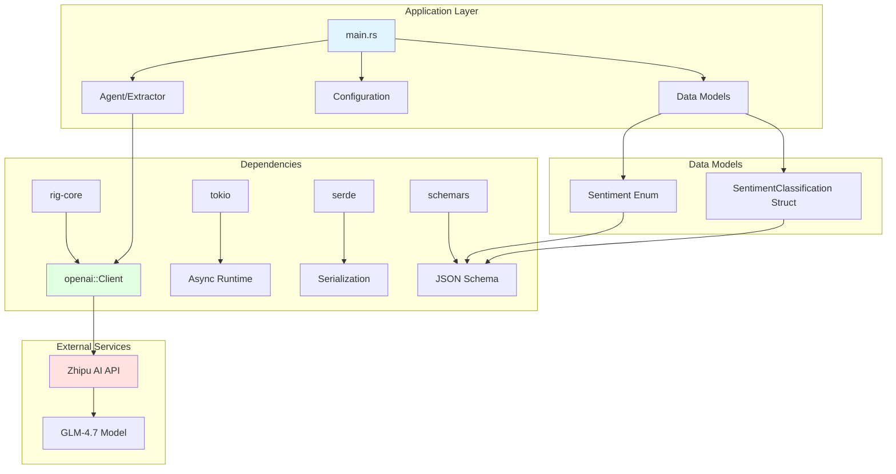

# Text Classifier Extractor - Project AI Context

**Last Updated**: 2026-02-06
**Project Status**: Early Development
**Language**: Rust 2024 Edition

---

## Project Vision

A Rust-based sentiment classifier leveraging **rig-core** framework and **Zhipu AI's GLM-4.7 API** to perform structured text extraction and sentiment analysis. The project demonstrates the integration of OpenAI-compatible APIs with Rust's type-safe structured extraction capabilities.

### Core Objectives

- **Sentiment Analysis**: Classify text into Positive, Negative, or Neutral sentiments
- **Structured Extraction**: Use Rust's type system with `schemars` for JSON schema generation
- **API Integration**: Connect to Zhipu AI's OpenAI-compatible endpoint
- **Extensibility**: Build a foundation for more complex text classification tasks

---

## Architecture Overview

```
┌─────────────────────────────────────────────────────────────┐
│                     Application Entry                        │
│                          (main.rs)                           │
└────────────────────┬────────────────────────────────────────┘
                     │
                     ├──► Configuration (.env)
                     │    └─ OPENAI_API_KEY
                     │    └─ OPENAI_BASE_URL
                     │
                     ├──► Data Models
                     │    ├─ Sentiment (Enum)
                     │    └─ SentimentClassification (Struct)
                     │
                     ├──► rig-core Integration
                     │    ├─ openai::Client
                     │    ├─ AgentBuilder (active)
                     │    └─ ExtractorBuilder (commented)
                     │
                     └──► External API
                          └─ Zhipu AI GLM-4.7
```

---

## Technology Stack

| Component | Crate | Version | Purpose |
|-----------|-------|---------|---------|
| **AI Framework** | `rig-core` | 0.11.1 | LLM integration & agents |
| **Runtime** | `tokio` | 1.34.0 | Async runtime |
| **Serialization** | `serde` | 1.0 | JSON serialization/deserialization |
| **Schema Generation** | `schemars` | 0.8 | JSON schema from Rust types |
| **Error Handling** | `anyhow` | 1.0.75 | Error context |
| **Environment** | `dotenv` | 0.15.0 | Environment variable loading |

---

## Module Structure

### Current Structure (Monolithic)

```
text_classifier_extractor/
├── src/
│   └── main.rs          # Entry point, models, and integration
├── Cargo.toml           # Dependencies
├── .env.example         # Environment template
└── .gitignore           # Git exclusions
```

### Recommended Modular Structure (Future)

```
text_classifier_extractor/
├── src/
│   ├── main.rs              # Entry point
│   ├── models/
│   │   ├── mod.rs           # Model exports
│   │   └── sentiment.rs     # Sentiment types
│   ├── classifiers/
│   │   ├── mod.rs
│   │   └── sentiment.rs     # Classifier logic
│   └── config/
│       ├── mod.rs
│       └── env.rs           # Environment loading
├── tests/
│   └── integration_test.rs  # API tests
└── examples/
    └── basic_usage.rs       # Usage examples
```

---

## Key Components

### 1. Data Models (`main.rs:6-17`)

```rust
pub enum Sentiment {
    Positive,
    Negative,
    Neutral,
}

pub struct SentimentClassification {
    pub sentiment: Sentiment,
    pub confidence: f32,
}
```

**Purpose**: Type-safe sentiment representation with schema generation support.

**Dependencies**:
- `serde::{Deserialize, Serialize}`
- `schemars::JsonSchema`

### 2. API Client (`main.rs:24-31`)

```rust
let openai_client = openai::Client::from_url(&api_key, &base_url);
```

**Configuration**:
- `OPENAI_API_KEY`: Zhipu AI API key
- `OPENAI_BASE_URL`: Defaults to `https://open.bigmodel.cn/api/coding/paas/v4`

### 3. Active Implementation (Agent)

**Current State**: Comedian agent for testing API connectivity
```rust
let comedian_agent = openai_client
    .agent("glm-4.7")
    .preamble("...")
    .build();
```

### 4. Commented Implementation (Extractor)

**Future State**: Structured sentiment extraction
```rust
let sentiment_classifier = openai_client
    .extractor::<SentimentClassification>("glm-4.7")
    .preamble("...")
    .build();
```

---

## Development Standards

### Code Organization Principles

1. **Type Safety First**: Leverage Rust's type system for all data structures
2. **Error Handling**: Use `anyhow::Result<T>` for application-level errors
3. **Async/Await**: All I/O operations must be async with `tokio`
4. **Schema-Driven**: Use `schemars` for JSON schema generation
5. **Environment Configuration**: Never hardcode credentials; use `.env`

### Naming Conventions

- **Structs/Enums**: `PascalCase` (e.g., `SentimentClassification`)
- **Functions/Variables**: `snake_case` (e.g., `api_key`, `sentiment_classifier`)
- **Constants**: `SCREAMING_SNAKE_CASE` (e.g., `OPENAI_API_KEY`)

### Testing Strategy

```rust
// Unit test structure (to be implemented)
#[cfg(test)]
mod tests {
    use super::*;

    #[tokio::test]
    async fn test_sentiment_extraction() {
        // Test classification logic
    }
}
```

---

## Development Workflow

### Setup

```bash
# Clone and navigate
cd text_classifier_extractor

# Create environment file
cp .env.example .env
# Edit .env with your API key

# Run
cargo run

# Test
cargo test
```

### Adding New Features

1. **Define Data Models**: Add structs/enums with appropriate derives
2. **Configure Extractor**: Set up `ExtractorBuilder` with model
3. **Implement Logic**: Add extraction/prompting logic
4. **Add Tests**: Write unit and integration tests
5. **Document**: Update this CLAUDE.md

### Dependency Management

```toml
# When adding new dependencies:
[dependencies]
new_crate = "version"  # Add here

# For development-only tools:
[dev-dependencies]
dev_crate = "version"
```

---

## API Integration Details

### Zhipu AI GLM-4.7

- **Provider**: Zhipu AI (BigModel)
- **Model**: `glm-4.7`
- **Endpoint**: `https://open.bigmodel.cn/api/coding/paas/v4`
- **Compatibility**: OpenAI API compatible
- **Documentation**: https://open.bigmodel.cn/

### Authentication

```rust
// Environment variables required
OPENAI_API_KEY=<your-zhipu-api-key>
OPENAI_BASE_URL=https://open.bigmodel.cn/api/coding/paas/v4
```

---

## Known Issues & TODOs

### Current State

- [x] Basic project structure
- [x] Dependency configuration
- [x] Data model definitions
- [x] API client setup
- [x] Basic agent implementation (comedian)
- [ ] Structured extractor implementation
- [ ] Error handling refinement
- [ ] Comprehensive tests
- [ ] Documentation

### Immediate Next Steps

1. **Uncomment Extractor Code**: Implement the structured sentiment extraction
2. **Add Error Recovery**: Handle API failures gracefully
3. **Add Logging**: Use `tracing` for request/response logging
4. **Create Tests**: Add unit tests for models and integration tests for API
5. **Modularize**: Split `main.rs` into logical modules

---

## Extension Points

### Adding New Classifiers

```rust
// Define new classification type
#[derive(Debug, Deserialize, Serialize, JsonSchema)]
struct TopicClassification {
    topic: String,
    subtopics: Vec<String>,
}

// Create extractor
let topic_extractor = openai_client
    .extractor::<TopicClassification>("glm-4.7")
    .preamble("Classify the topic of the text...")
    .build();

// Use
let result = topic_extractor.extract(text).await?;
```

### Supporting Multiple LLMs

```rust
// Generic over client type
async fn classify_with<Client>(
    client: &Client,
    text: &str,
) -> Result<SentimentClassification>
where
    Client: LLMProvider,
{
    // Implementation
}
```

---

## File Navigation

| File | Purpose | Key Content |
|------|---------|-------------|
| `src/main.rs` | Entry point & logic | Models, agent setup, main function |
| `Cargo.toml` | Dependencies | Crate declarations |
| `.env.example` | Config template | Required environment variables |
| `.gitignore` | Git config | Exclusions (target/, .env) |

---

## Mermaid Architecture Diagram



---

## References

- **rig-core Documentation**: https://github.com/drig-tech/rig
- **Zhipu AI Platform**: https://open.bigmodel.cn/
- **serde Documentation**: https://serde.rs/
- **schemars Documentation**: https://graham.cool/schemars/

---

## Version History

| Date | Version | Changes |
|------|---------|---------|
| 2026-02-06 | 0.1.0 | Initial project setup, basic agent implementation |

---

**Note**: This document should be updated as the project evolves. Keep it synchronized with code changes.
